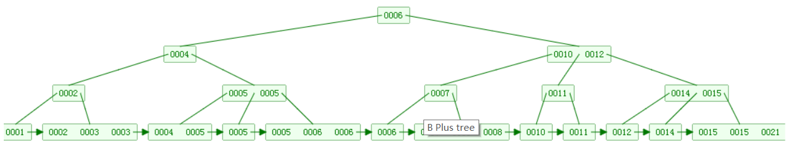

# Mysql

## 视图

> 创建视图

CREATE VIEW 视图名[字段 ..]  AS 查询sql语句

> 更新视图

CREATE OR REPLACE VIEW 视图名 [字段..] AS 查询的sql语句

或

ALTER VIEW 视图名 [字段...]  AS 查询的sql语句

> 删除视图

DROP VIEW 视图名

> 查看数据中哪些是表哪些是视图

show table status

==视图的优点==

- 查询性能提高
  - 相对于直接SQL省去了语法检查和解析阶段的开销
- 改动表结构 达到少修改的效果
  - 假如因为某种需要a表和b表需要进行合并起来组成一个新的表c最后a表和b表都不会存在了，而且由于原来程序中编写sql分别是基于a表和b表查询的。这就意味着需要重新编写大量的sql(改成向c表去操作数据) 而通过视图就可以做到步修改 定义两个视图名字还是原来的表名a和b。a  b视图完成从c表中取出内容。比如视图名a 那么 查询还是select * from a
- 复杂的查询需求
  - 可以进行问题分解 然后将创建多个视图获取数据 将视图联合起来就能得到需要的结果。

## 索引

### B+ Tree

> B+ Tree 是基于B Tree和叶子节点顺序访问指针进行实现，具有B Tree的平衡性，叶子节点通过顺序访问来提高查询效率。



**B+树优点：**

- 内部节点上不含数据信息，能够存放更多的key。数据存放紧密，具有更好的空间局部性。(具有更好的命中率)
- 由于叶子节点的数据是用链表相连的。便于区间查找和搜索。
- 具有更低的树高(因为不存储具体数据，可以扩展每页存储索引的数量，使得树高降低)

**B树优点：**

- 每个节点都包含key和value。因此经常访问的元素可能离根节点更近，访问更迅速。

### MySQL索引

#### 聚簇索引：

> B+ 树: 叶子节点存放整张表的记录数据，索引组织表中数据也是索引的一部分。(每张表只能拥有一个聚簇索引)-->> Innodb

**优点:**

- 数据访问更快，beacuse 数据和索引保存在同一个B+树中。
- 聚簇索引对于主键的排序查找和范围查找速度非常块

**缺点：**

- 插入速度严重依赖于插入顺序，按照主键插入最快，否则会出现页分裂，严重影响性能。(通常有一个自增id)
- 更新主键代价好高，一般主键不更新
- 二级索引访问需要两次索引查找，第一次找到主键，第二次根据主键值找到行数据

#### 非聚集索引

> 聚集索引之上创建的索引称为辅助索引

非聚集索引叶子节点存储的不再是行的物理位置，而是主键值。首先通过辅助索引找到主键值，再通过主键值找到数据行的数据页，再通过数据页找到数据行。

#### 哈希索引

> 能以O(1) 时间进行查找，但是失去了有序性

- 无法用于排序和分组
- 只支持精确查找，无法用于部分查找和范围查找

#### 全文索引

MyISAM存储引擎支持全文索引，用于查找文本中的关键词，而不是直接比较是否相等。

全文索引使用倒排索引实现，记录着关键词到其所在文档的映射

## 查询性能优化

### 使用Explain进行分析

> Explain用来分析SELECT查询语句，开发人员可以通过分析Explain结果来优化查询语句。

**比较重要的字段:**

- select_type: 查询类型，有简单查询，联合查询，子查询等
- key: 使用的索引
- rows: 扫描的行数

### 优化数据访问

**1. 减少请求的数据量**

- 只返回必要的列：最好不要使用SELECT * 语句
- 只返回必要的行：使用LIMIT语句来限制返回的数据
- 缓存重复查询的数据：对于经常查询的数据，可以储存在缓存中

**2. 减少服务器端扫描的行数**

> 最有效的方式是使用索引来覆盖查询

### 重构查询方式

**1. 切分大查询**

一个大查询如果只执行一次的话，可能一次锁住很多数据，占满整个事务日志，耗尽系统资源，阻塞很多小的但重要的功能。

```sql
DELEET FROM messages WHERER create < DATE_SUB(NOW(),INTERVAL 3,MONTH);

------------------------
rows_affected = 0
do {
    rows_affected = do_query(
    "DELETE FROM messages WHERE create  < DATE_SUB(NOW(), INTERVAL 3 MONTH) LIMIT 10000")
} while rows_affected > 0
```

**2. 分解大连接查询**

- 让缓存更高效  -->  对于整个连接查询如果一个表发生变化，整个缓存就无法使用，分解后可以。
- 减少数据冗余
- 减少锁竞争
- 在应用层方面，做到更容易操作，可复用

之前的sql

```sql
SELECT * FROM tag
JOIN tag_post ON tag_post.tag_id=tag.id
JOIN post ON tag_post.post_id=post.id
WHERE tag.tag='mysql';
```

修改之后的sql

```sql
SELECT * FROM tag WHERE tag='mysql';
SELECT * FROM tag_post WHERE tag_id=1234;
SELECT * FROM post WHERE post.id IN (123,456,567,9098,8904);
```

## 存储引擎

**InnoDB**

- 是MySQL默认的事务型存储引擎，默认的隔离级别是可重复读(REPEATABLE READ) 
- 聚簇索引，在索引中读取数据，从而避免直接读取磁盘，对查询性能有很大的帮助
- 内部优化：从磁盘读取数据采用可预测性读，加快读操作自动创建自适应哈希索引，加速插入操作。
- 支持热备份，可以在其他线程读取的情况下生成视图

**MyISAM**

- 提供了大量的特性，包括压缩表，空间数据索引
- 不支持事务
- 不支持行级锁，读取时对整张表加共享锁，写入时对整张表加排他锁。、

**比较**

-  事务：InnoDB是事务型的，可以使用Commit和Rollback语句
- 并发：MyISAM只支持表级锁，而InnoDB还支持行级锁
- 外键：InnoDB支持外键
- 备份：InnoDB支持在线热备份
- 崩溃恢复：MyISAM崩溃后发生损坏的概率比InnoDB高很多，而且恢复的速度也更慢
- 其他特性：MyISAM支持压缩表的空间数据索引

## 数据类型

### 整型

TINYINT, SMALLINT, MEDIUMINT, INT, BIGINT 分别使用 8, 16, 24, 32, 64 位存储空间，一般情况下越小的列越好。
INT(11) 中的数字只是规定了交互工具显示字符的个数，对于存储和计算来说是没有意义的。

### 浮点数

FLOAT 和 DOUBLE 为浮点类型，DECIMAL 为高精度小数类型。CPU 原生支持浮点运算，但是不支持 DECIMAl 类型的计算，因此 DECIMAL 的计算比浮点类型需要更高的代价。

FLOAT、DOUBLE 和 DECIMAL 都可以指定列宽，例如 DECIMAL(18, 9) 表示总共 18 位，取 9 位存储小数部分，剩下 9 位存储整数部分。

### 字符串

主要有 CHAR 和 VARCHAR 两种类型，一种是定长的，一种是变长的。

VARCHAR 这种变长类型能够节省空间，因为只需要存储必要的内容。但是在执行 UPDATE 时可能会使行变得比原来长，当超出一个页所能容纳的大小时，就要执行额外的操作。MyISAM 会将行拆成不同的片段存储，而 InnoDB 则需要分裂页来使行放进页内。

在进行存储和检索时，会保留 VARCHAR 末尾的空格，而会删除 CHAR 末尾的空格。

### 时间和日期

MySQL 提供了两种相似的日期时间类型：**DATETIME** 和 **TIMESTAMP**。

#### DATETIME

能够保存从 1000 年到 9999 年的日期和时间，精度为秒，使用 8 字节的存储空间。

它与时区无关。

默认情况下，MySQL 以一种可排序的、无歧义的格式显示 DATETIME 值，例如“2008-01-16 22:37:08”，这是 ANSI 标准定义的日期和时间表示方法。

#### TIMESTAMP

和 UNIX 时间戳相同，保存从 1970 年 1 月 1 日午夜（格林威治时间）以来的秒数，使用 4 个字节，只能表示从 1970 年到 2038 年。

它和时区有关，也就是说一个时间戳在不同的时区所代表的具体时间是不同的。

MySQL 提供了 FROM_UNIXTIME() 函数把 UNIX 时间戳转换为日期，并提供了 UNIX_TIMESTAMP() 函数把日期转换为 UNIX 时间戳。

默认情况下，如果插入时没有指定 TIMESTAMP 列的值，会将这个值设置为当前时间。

应该尽量使用 TIMESTAMP，因为它比 DATETIME 空间效率更高。

## 切分

### 水平切分

水平切分又称为 Sharding，它是将同一个表中的记录拆分到多个结构相同的表中。

当一个表的数据不断增多时，Sharding 是必然的选择，它可以将数据分布到集群的不同节点上，从而缓存单个数据库的压力。


