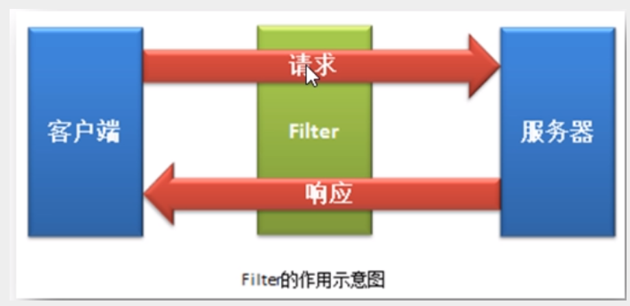
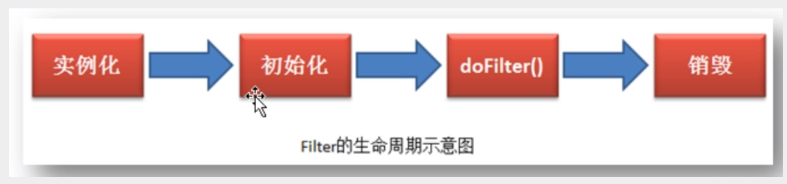

# Filter(过滤器)

> Filter是Servlet规范的三大组件之一，顾名思义，就是过滤。可以在请求到达目标资源之前先对请求进行过滤拦截。
>
> 即对请求进行一些处理；也可以在响应到达客户端之前先对响应进行拦截过滤，即对响应进行一些处理。




## Fliter的生命周期

​	Filter的生命周期与Servlet的生命周期类似，其主要生命周期阶段有四个：Filter对象的创建，Filter对象的初始化，Filter执行doFilter()方法，及其最终Filter对象被销毁。

​	Filter的整个生命周期过程的执行，均由Web服务器负责管理。即Filter从创建到销毁的整个过程中方法的调用，都是由Web服务器负责调用执行的，程序员无法控制其执行流程。



**基本配置**

```java
package com.iscas.config;

import com.iscas.filters.SomeFilter;
import org.springframework.beans.factory.annotation.Configurable;
import org.springframework.boot.web.servlet.FilterRegistrationBean;
import org.springframework.context.annotation.Bean;
import org.springframework.context.annotation.Configuration;

import java.util.Arrays;

/**
 * @author chenbin
 * @datetime 2020-07-24 10:25
 */
@Configuration
public class MyFilterConfig {

    @Bean
    public FilterRegistrationBean myFilter(){
        FilterRegistrationBean filterRegistrationBean = new FilterRegistrationBean();
        filterRegistrationBean.setFilter(new SomeFilter());
//        filterRegistrationBean.setUrlPatterns(Arrays.asList("/hello1","/hello2"));
        // 拦截所有请求
        filterRegistrationBean.setUrlPatterns(Arrays.asList("/*"));
        return filterRegistrationBean;
    }
}
```


**实现filter接口**

```java
 @Override
    public void doFilter(ServletRequest servletRequest, ServletResponse servletResponse, FilterChain filterChain) throws IOException, ServletException {
        /**
         * 客户端  -----> 拦截器 --------> 服务器     before
         * 客户端         拦截器           服务器     doFilter
         * 客户端 <------ 拦截器 <-------- 服务器     after
         */
        // 执行filter语句
        System.out.println("执行SomeFilter -- before --");
        // 放行,要执行这个语句,才能返回给客户端
        filterChain.doFilter(servletRequest,servletResponse);
        System.out.println("执行SomeFilter -- after -- ");
    }
```

只有执行完doFilter之后，前端页面才会显示

**其中两个初始化方法，在应用启动的时候就会加载**

```java
 public SomeFilter(){
        System.out.println("创建someFilter");
    }

    @Override
    public void init(FilterConfig filterConfig) throws ServletException {
        System.out.println("初始化SomeFilter");
    }
```

以上两个方法，如果打开同一个页面，都不会再次被调用，只执行一次(单例)

**销毁方法只有在服务器被关闭的时候调用**

```java
 @Override
    public void destroy() {
        System.out.println("销毁SomeFilter");
    }
```

> 总结

过滤器实现代码

```java
package com.iscas.filters;

import javax.servlet.*;
import java.io.IOException;

/**
 * @author chenbin
 * @datetime 2020-07-24 10:15
 */

/**
 * Filter是在应用启动时被创建和初始化的
 * Filter是单例的，刷新页面init不会再次被调用 (多线的)
 * Filter是在应用被停止时被销毁的
 * doFilter() 方法无论哪个进程访问，只要由Filter进行过滤，那么就会执行该Filter的doFilter方法
 * 并且是每过滤一次就会执行一次doFilter()。
 * 由于filter是单例多线程的，为了保证其线程安全性，一般是不为Filter添加可修改的成员变量。
 */
public class SomeFilter implements Filter {

    public SomeFilter(){
        System.out.println("创建someFilter");
    }

    @Override
    public void init(FilterConfig filterConfig) throws ServletException {
        System.out.println("初始化SomeFilter");
    }

    @Override
    public void doFilter(ServletRequest servletRequest, ServletResponse servletResponse, FilterChain filterChain) throws IOException, ServletException {
        /**
         * 客户端  -----> 拦截器 --------> 服务器     before
         * 客户端         拦截器           服务器     doFilter
         * 客户端 <------ 拦截器 <-------- 服务器     after
         */
        // 执行filter语句
        System.out.println("执行SomeFilter -- before --");
        // 放行,要执行这个语句,才能返回给客户端
        filterChain.doFilter(servletRequest,servletResponse);
        System.out.println("执行SomeFilter -- after -- ");
    }

    @Override
    public void destroy() {
        System.out.println("销毁SomeFilter");
    }
}

```

## Filter的param参数

将init方法传入的FilterConfig用set方法注入到方法内

```java
// FilterConfig 指的是Filter在web.xml 中的注册信息
    private FilterConfig filterConfig;

 @Override
    public void init(FilterConfig filterConfig) throws ServletException {
        // 注入上去，并在doFilter中使用
        this.filterConfig = filterConfig;
    }

 @Override
    public void doFilter(ServletRequest servletRequest, ServletResponse servletResponse, FilterChain filterChain) throws IOException, ServletException {
        // 获取FilterName
        String fileName = filterConfig.getFilterName();
        System.out.println("filterName= "+fileName);

        // 获取所有的初始化参数名称
        Enumeration<String> names = filterConfig.getInitParameterNames();
        //遍历枚举
        while (names.hasMoreElements()){
            String name = names.nextElement();
            String value = filterConfig.getInitParameter(name);
            System.out.println(name +"="+ value);
        }
    }
```

> /*： 表示当前Servlet 可以匹配所有的请求，即可以拦截所有的请求，无论发出的是静态资源，还是动态资源的访问请求，统统会被拦截。
>
> /： 不会拦截动态资源请求，即不会拦截对应jsp页面的请求，但会拦截静态资源请求

filter-mapping中可以不使用url-pattern，但需要指定servlet-name，即当前过滤器拦截的是对指定servlet的请求

## dispatcher四个标签

- FORWARD:表示当前过滤器只会拦截由一个Servlet通过RequestDispatcher的forward() 完成的跳转
- INCLUDE：表示当前过滤器只会拦截由一个Servlet通过RequestDispatcher的include() 完成的跳转
- REQUEST：表示当前过滤器会拦截普通请求，但对于forward()与include的跳转不进行拦截。默认值
- ERROR：表示当跳转到指定的错误处理页面时，这个跳转请求会被当前过滤器拦截。


> - **FORWARD**
>
> 若请求是由一个Servlet通过RequestDispather的forward()方法转发的，那么这个请求将被<dispatcher/>值为FORWARD的Filter拦截。即当前Filter只会拦截由RequestDispatcher的forward() 方法所转发的请求。其他请求均不拦截


> - INCLUDE:当前Filter只会拦截由RequestDispatcher的include()方法所转发的请求。其他均不拦截。


当应用中存在多个Filter时，其执行顺序与其注册顺序一致。

Filter是访问的时候创建，而Servlet是应用启动的时候创建


